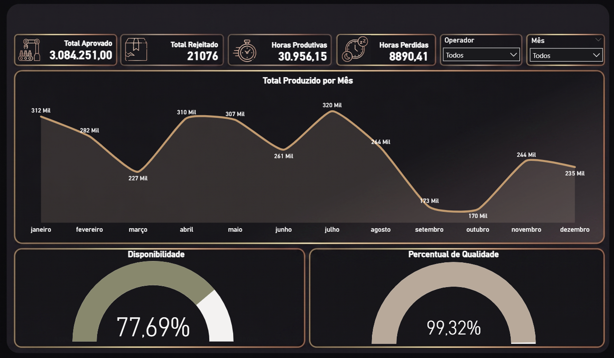

📊 Dashboard de Produção Industrial 📊

Projeto
Painel interativo desenvolvido no Power BI para monitoramento de KPIs operacionais em tempo real, focado em eficiência e controle de perdas.

📌 Indicadores Monitorados

Eficiência: Percentual de Qualidade e Disponibilidade.
Produtividade: Total Aprovado vs. Total Rejeitado.
Gargalos: Comparativo de Horas Produtivas vs. Horas Perdidas.
Tendência: Evolução mensal do volume produzido.

🛠️ Tecnologias e Ferramentas
Ferramenta: Power BI Desktop.
Linguagem: DAX (Medidas de desempenho).
Data Prep: Power Query (ETL).
UI Design: Layout personalizado em Dark Mode.

🚀 Como visualizar
1 - Baixe o arquivo na pasta /pbix.
2 - Abra no Power BI Desktop.
3- Utilize os filtros de Operador e Mês no canto superior direito para interagir.

🤝 Contato
- LinkedIn: https://www.linkedin.com/in/murillo-marins-200316253/
- GitHub: https://github.com/Mu-grills/Mu-grills
